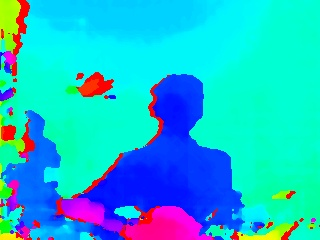

# Stereocamera feasibility analysis 
This project aims to evaluate whether a stereocamera (DUO3D MC) provides better results than a monocamera (Widecam F100) for a self-driving car.
In this context, a depth image is generated and objects are detected.

## Calibration and rectification
The calibration successful calibration and rectification parameters are saved in the location ./calibration.
The calibration normally should be fine for the DUO3D, but you can also record new images, which should be saved in the directory ./calibimg.
Check the class "Stereocalibration" for further information.

## Disparity map
These parameters are used and necessary to display a disparity image through a comparison of the two images.
The disparity is converted into a colored map and the result looks as the following:

The class "Disparity" contains all elements that are necessary.

## Reprojection to pointcloud
After the calculation of the disparity map, the class "Reprojection3D" is responsible for the calling the OpenCV function reprojectionto3D.
Moreover, the result is saved with the function save_pointcloud as a *.ply file. You can plot it with Meshlab.
The results look like this:

Clearly, these obstacles (although the bottle is sheer) are transformed into the pointcloud.
These plots are recorded with the DUO Dashboard.

## Object detection with monocamera
To compare the results between a monocamera and a stereocamera, an object detection is implemented.
The algorithm is based on a color segmentation of the white color, after HSV transformation.

A white object is detected with ease, although it is small. The software has actually problems with several objects.

## Dataflow
The stereocamera is not plug and play compatible with OpenCV and needs therefore some information and settings to be accessible.
After the opening with the class "DUOInput", the images will be undistorted and rectified.
With these images, a disparity image is created, that is basis for the pointcloud generation.
Moreover, the project can detect objects with a monocamera.
In future, the class "Object_detect" will be implemented as the superclass of the "Object_detect_mono" and "Objection_detect_stereo".
The class "Object_Dense3D" is currently not working because of an insufficient documentation.